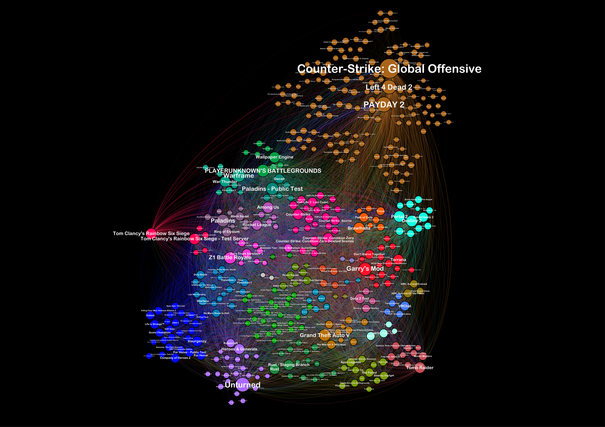
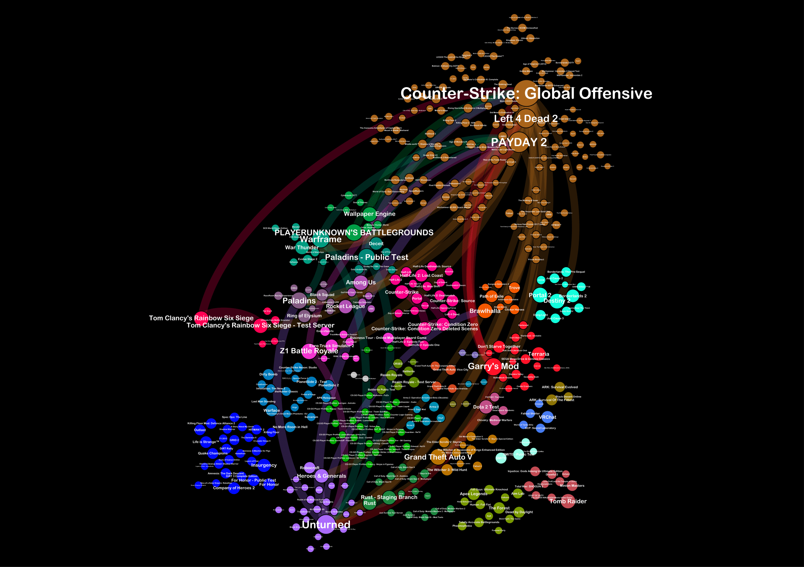

# Visualizing Games on Steam
## Overview
This project aims to map popular games on Steam in a way that feels intuitive to both gamers and developers. This is accomplished by collecting the lists of games of many steam users, comparing those lists, and turning that information into a network diagram. All code is written in python and the visualization is done using Gephi.
## Results
### 10,000 users

## Gephi parameters
### Overview
1. Modularity: 0.5
2. Layout -> Circle Pack Layout: 

   * Hierarchy1: Modularity class
   * Hierarchy2: Degree
 
3. Nodes -> Size -> Ranking -> Count: 1) min size: 5; 2) max size: 20
4. Nodes -> Label Size -> Ranking -> Degree: 1) min size 1; 2) max size: 3
### Preview
1. Presets: Default
2. Node Labels:  
   
   * Show Labels: +
   * Font: Arial Rounded MT Bold
   * Font Style: Plain
   * Size: 2
   * Proportional size: +
   * Color: custom [255,255,255]
   * Shorten Label: -
   * Max characters: 30
   * Outline size: 0
   * Outline color: custom [255,255,255]
   * The rest is default...

3. Edges: 

   * Show Edges: +
   * Thickness: 0.1
   * Rescale weight: +
   * Min. rescaled weight: 0.1
   * Max. rescaled weight: 1.0
   * Color: source
   * Opacity: 50
   * Curved: +
   * The rest is default...
### Overlap parameters
1. Filters -> Edges -> Edge weight: 1500-3923
## Credits
This is a final project for the CSS 253 course done by [Amir Zhangirbayev](https://github.com/amirzhangirbayev)

Examined by Zhangir Rayev
